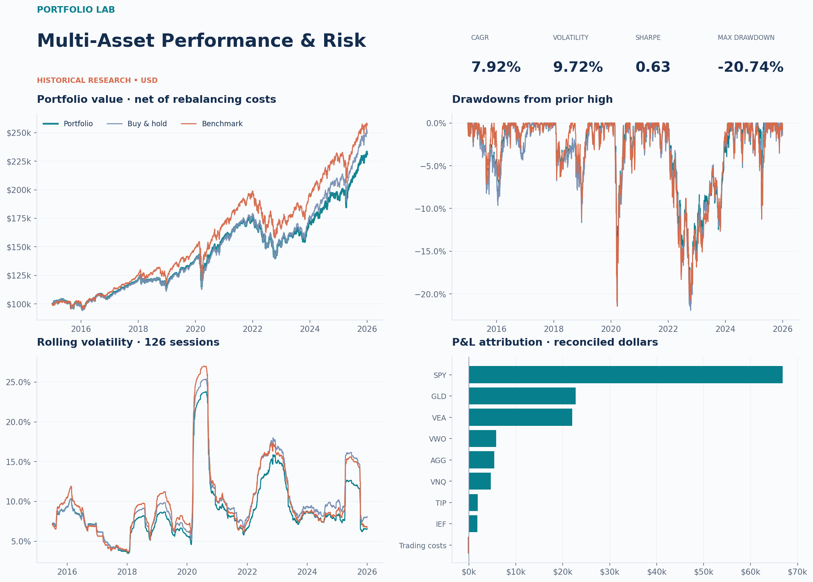

# Portfolio Lab — Multi-Asset Performance & Risk

A complete Colab and Python research project for comparing a rebalanced multi-asset portfolio, buy-and-hold, and a configurable benchmark.

**The included example uses synthetic data. Its results are not historical ETF performance.** Switch to Yahoo mode to download real adjusted prices.

## Start in Google Colab

1. Open https://colab.research.google.com/.
2. Choose **File → Upload notebook** and upload **notebooks/Multi_Asset_Portfolio_Dashboard.ipynb**.
3. Leave **DATA_MODE = "demo"** for the reproducible offline example.
4. Select **Runtime → Run all**.
5. Download the generated dashboard and result bundle from the final cell.

The notebook is self-contained: its visible source cells create the Python package. You do not need to upload the repository as well. To use actual prices, change DATA_MODE to "yahoo" and run all cells again. Yahoo mode installs the optional yfinance adapter. To use a CSV, upload it to Colab and set CSV_PATH to its absolute path.

## Run locally

Python 3.10 or newer is required; Python 3.12 was used for local verification.

~~~bash
python -m venv .venv
source .venv/bin/activate
python -m pip install -r requirements.txt
python -m portfolio_lab --mode demo
python -m unittest discover -s tests -v
~~~

On Windows, activate with **.venv\Scripts\activate**. Open **reports/dashboard.html** in a browser after the run.

~~~bash
# Real adjusted prices: network access and Yahoo availability required.
python -m pip install -r requirements-live.txt
python -m portfolio_lab --mode yahoo --start 2015-01-01 --end 2026-01-01

# Read a user-supplied adjusted-price file.
python -m portfolio_lab --mode csv --csv path/to/adjusted_prices.csv

# Change portfolio mechanics.
python -m portfolio_lab --mode demo --rebalance quarterly --cost-bps 10
~~~

For historical risk-free yield proxies, set FRED_API_KEY in your environment and pass **--fred**. In Colab, store the key in **Secrets → FRED_API_KEY**, enable notebook access, and set USE_FRED = True. Credentials are not saved in reports.

## What is implemented

- Eight configurable ETF allocations; a default 60% SPY / 40% AGG benchmark.
- Holdings drift between rebalances, with close trades affecting subsequent returns.
- Transaction costs funded from NAV using an exact self-financing cost equation.
- Daily return and dollar P&L reconciliation, benchmark-relative metrics, and risk attribution.
- Strict missing-data handling, explicit common-history trimming, bounded API retries and checksummed snapshots.
- Ten professional PNG/SVG chart exports and a self-contained interactive HTML dashboard.
- CSV outputs, a configuration/provenance manifest, financial correctness tests, and GitHub CI.

**[Read the complete 15-part project guide](docs/PROJECT_GUIDE.md)** for architecture, implementation steps, formulas, API choices, outputs, a résumé description, and extensions.

## Portfolio conventions

The first date represents an already-invested portfolio. Initial purchase and final liquidation costs are excluded consistently. Positions are fractional total-return units, not executable broker share counts. All assets are USD-listed; no leverage, external deposits, taxes, or separate cash allocation are modeled.

Rebalancing occurs at the close of the first observed session in a new calendar period. A cost of 5 basis points means 0.0005 times the gross dollar amount bought plus sold. The default cash-rate assumption is a clearly labelled fixed 2% effective annual rate, not a reconstructed historical rate.

Adjusted-close returns already incorporate the provider's distribution and split adjustments. The engine does not add dividends a second time. Live data may be revised by the provider; preserve the run manifest and cached snapshot for reproducibility.

## Data rights and sources

- [yfinance API documentation](https://ranaroussi.github.io/yfinance/reference/api/yfinance.download.html)
- [yfinance project and Yahoo usage notes](https://github.com/ranaroussi/yfinance)
- [FRED observations API](https://fred.stlouisfed.org/docs/api/fred/series_observations.html)
- [FRED DGS3MO series definition](https://fred.stlouisfed.org/series/DGS3MO)

yfinance is unofficial. Check the provider's data-use terms before redistributing downloaded market data. Generated caches and reports are ignored by git; the included examples contain only synthetic data.

## Verification

See **docs/VALIDATION.md** for actual execution results and the boundaries of live-provider and browser testing. Undefined statistical ratios remain NaN/N/A.

## Publishing on GitHub

Upload this project directory to a repository you own. Keep the example image and clearly labelled synthetic outputs for an immediately reviewable demonstration. Run Yahoo mode yourself, preserve its manifest, and write a short research memo interpreting actual results before presenting empirical findings in an interview.

The original repository distribution includes tools/build_notebook.py to regenerate the notebook. The notebook embeds source code rather than downloading it from an unpinned repository.
